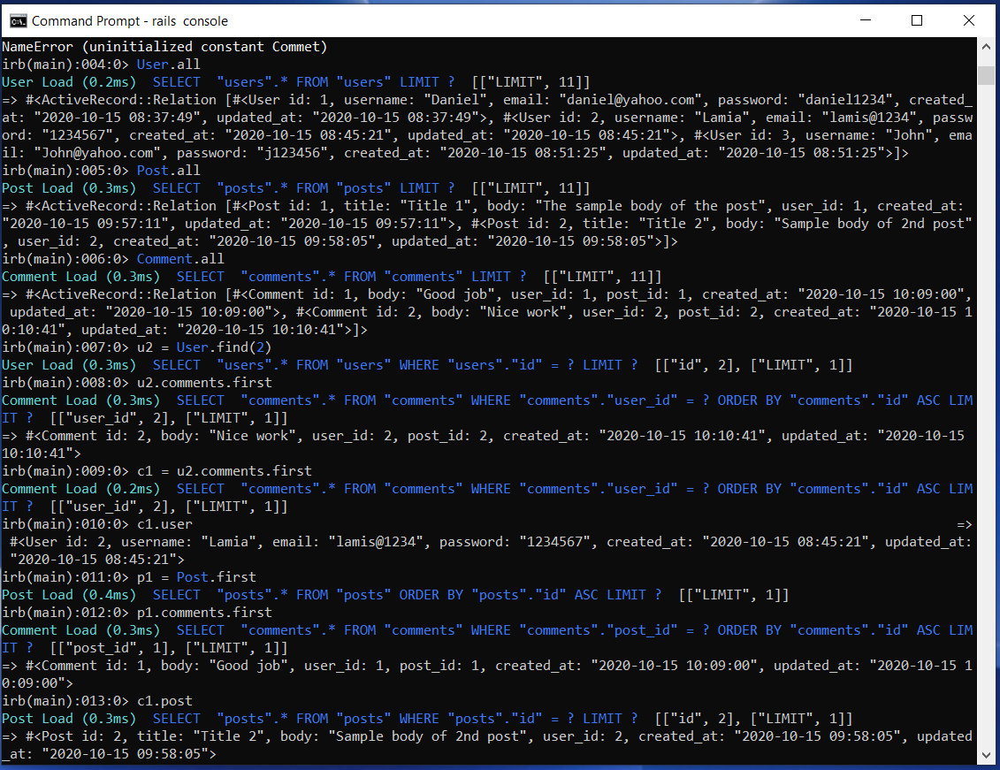

# Active Records Model of Micro-Reddit

This project is an application similar to Reddit (called Micro-Reddit) where a user can create a post and add comments to it.



## Build-With

- Ruby -v  2.7.1
- Rails -v 5.2.4.4
- SQLite3
- VScode


## Getting Started

### Prerequisites

To get this project up and running locally, you must already have ruby and necessary gems installed on your computer

**To get this project set up on your local machine, follow these simple steps:**

1. Open Terminal.
2. Navigate to your desired location to download the contents of this repository.
3. Copy and paste the following code into the Terminal: git clone https://github.com/LamiaSristy/micro-reddit
4. Run ```micro-reddit```.
5. Run ```bundle install``` to get the necesary gems.
6. Run `rails db:migrate`.


## Author Details::

👤 **Lamia Sristy**

- Github: [@LamiaSristy](https://github.com/LamiaSristy)
- Linkedin: [@LamiaSristy](https://www.linkedin.com/in/lamia-hemayet-sristy/)
- E-mail: <a href="mailto:lamiasristy@gmail.com?subject=Hello Lamia!">Email</a>  
- Twitter: [@LamiaSristy](https://twitter.com/lsristy1)

👤 **Aye Daniel A**

- Github: [Github](https://github.com/Alaska01)
- Twitter: [Twitter](https://twitter.com/AyeAsoo)
- E-mail: <a href="mailto:aadaniel108@gmail.com?subject=Hello Daniel!">Email</a>  
- Linkedin: [Linkedin](https://www.linkedin.com/in/daniel-asoo-aye/)

## Acknowledgment
The resources we have used to develop our project:

- [Odin-project](https://www.theodinproject.com/courses/ruby-on-rails/lessons/building-with-active-record-ruby-on-rails)
- [Tutorialspoint](https://www.tutorialspoint.com/ruby-on-rails/rails-migrations.htm)
- [Guides](https://guides.rubyonrails.org/active_record_validations.html#length)

## Show your support

Give ⭐ Star me on GitHub — it helps!

## 📝 License

This project is [MIT](lic.url) licensed.  

